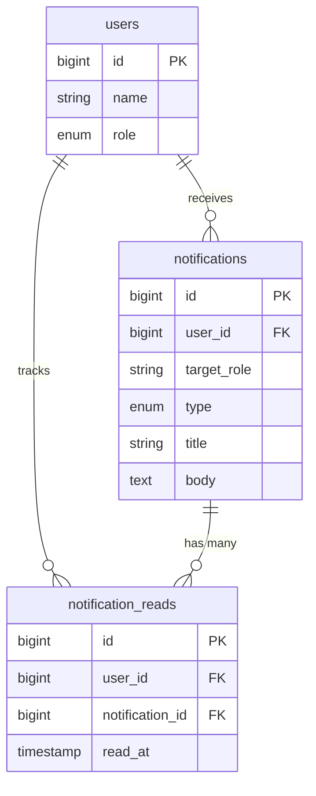

# Laravel Reverb Notification System

This project is a personal exploration and learning journey into **Laravel Reverb**. The primary goal is to understand real-time communication in Laravel 13 by building a functional notification system.

## Development Overview

The development of this project focused on implementing different broadcasting strategies provided by Laravel Reverb. While secondary optimizations like reference-based tracking were included to keep the database clean, the main emphasis remained on the WebSocket integration.

### Broadcasting Implementation

To explore the full capabilities of Reverb, I implemented three distinct targeting methods:

1.  **Public Broadcasting**: Used for global announcements sent via the `public-messages` channel.
2.  **Private Broadcasting**: Used for personal and role-based notifications, ensuring secure communication through Laravel's private channels (`user.{id}`).
3.  **Event Handling**: Exploration of `ShouldBroadcastNow` for immediate delivery and `ShouldBroadcast` for queued delivery.

### Frontend Integration

The frontend was designed to complement the real-time nature of the backend:

- **Live Updates**: Using Laravel Echo to listen for events and update the UI without page refreshes.
- **User Interaction**: Implementing searchable user selection with Tom Select and temporary toast previews for better feedback.
- **State Management**: Handling real-time data flow with Alpine.js to maintain a responsive interface.

## Broadcasting Types

This project provides two ways to handle notification events, as seen in `UserNotification.php` and `AllNotification.php`:

1.  **ShouldBroadcastNow (Instant)**
    - The event is sent directly to Reverb without waiting for a queue.
    - Best used for immediate delivery where low latency is critical.
2.  **ShouldBroadcast (Queued)**
    - The event is placed in a queue and processed by a worker.
    - Requires running `php artisan queue:work` for delivery.
    - Best for high-traffic scenarios to prevent blocking the main request.

## Key Features

- Real-time notifications via Laravel Reverb.
- Support for Global, Role-based, and Personal targeting.
- Reference-based read status tracking for database efficiency.
- Toast notification previews and unread indicators.
- Searchable user dropdown (Name, Role, Email) for targeted broadcasting.

## Usage Guide

### Sending Notifications (Admin)

1.  Log in as a user with the Admin role.
2.  Navigate to the Broadcast menu in the navigation bar.
3.  Select the Target Type (Specific User, By Role, or All Users).
4.  If Specific User is selected, use the search box to find a user.
5.  Enter the Title and Body, then click Send Notification.

### Receiving Notifications

1.  Target users will see a Toast Preview in the top-right corner when a message arrives.
2.  An unread indicator will appear on the Inbox icon in the navigation bar.
3.  The Inbox dropdown provides a list of recent notifications.
4.  Clicking a notification marks it as read and removes the unread indicator.

## Technical Stack

- **Backend**: Laravel 13, PHP 8.3
- **WebSocket**: Laravel Reverb
- **Frontend**: Alpine.js, Tailwind CSS, Tom Select
- **Database**: Reference-based tracking architecture

## Installation

1.  **Clone and Setup**

    ```bash
    git clone <repository-url>
    cd laravel-reverb
    cp .env.example .env
    composer install
    npm install
    php artisan key:generate
    ```

2.  **Database and Broadcasting**
    ```bash
    php artisan migrate:fresh --seed
    php artisan install:broadcasting
    ```

## Default Credentials

After running the seeders (`php artisan db:seed`), you can use the following accounts to test different targeting scenarios. The default password for all accounts is `password`.

| Role | Email Example | User ID Range |
| :--- | :--- | :--- |
| **Admin** | `user0@gmail.com` | 0 |
| **Manager** | `user1@gmail.com` - `user5@gmail.com` | 1 - 5 |
| **Employee** | `user6@gmail.com` - `user19@gmail.com` | 6 - 19 |

## Execution

To run the application, execute these commands in separate terminals:

1.  **Web Server**: `php artisan serve`
2.  **Assets**: `npm run dev`
3.  **WebSocket**: `php artisan reverb:start`
4.  **Queue**: `php artisan queue:work`

## Architecture



## Learning Resources

This project was built while studying and exploring the following resources:

-   [Official Laravel Reverb Documentation](https://laravel.com/docs/13.x/reverb)
-   [Building a Simple Laravel App with Reverb (Step-by-Step Guide)](https://dev.to/vimuth7/building-a-simple-laravel-app-with-reverb-a-step-by-step-guide-19g5)
